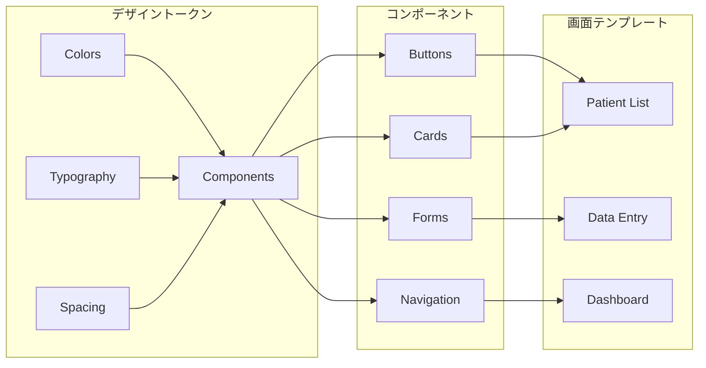
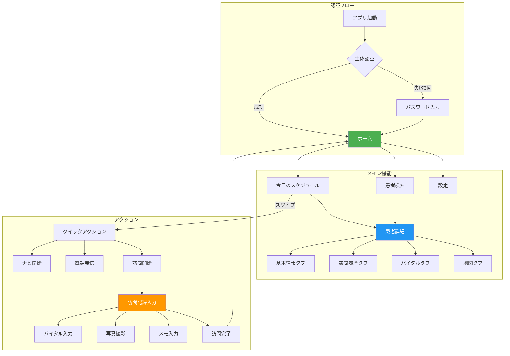
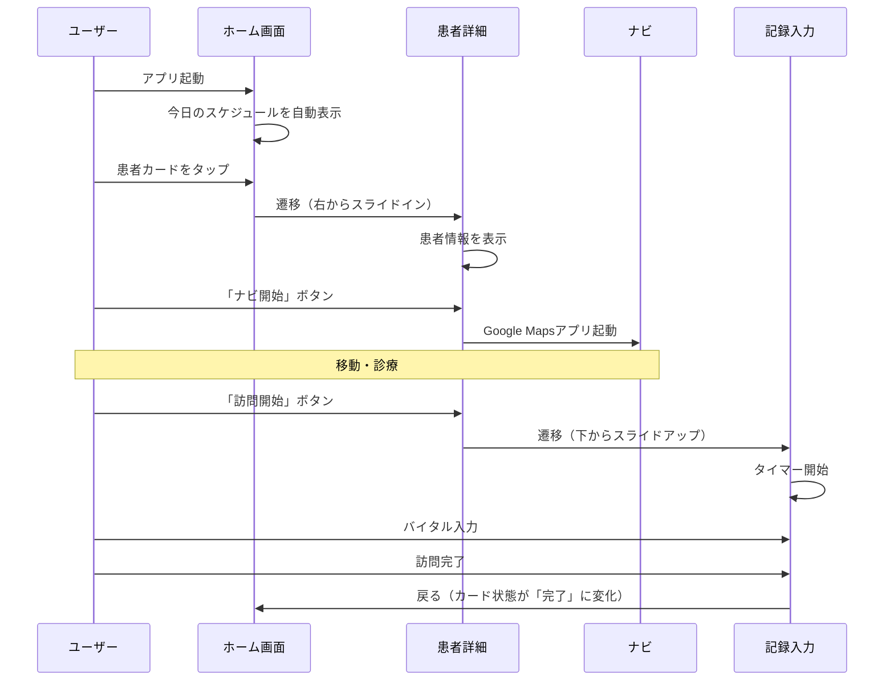
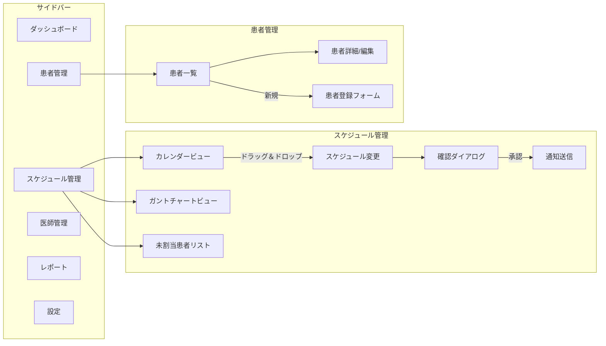
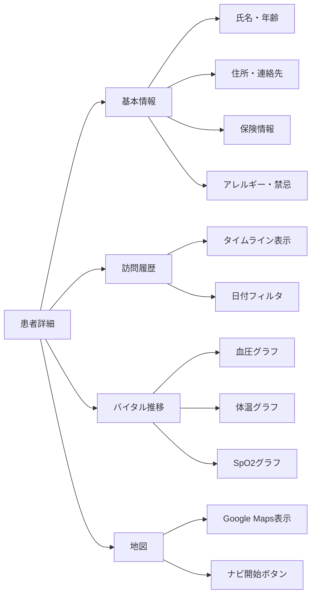
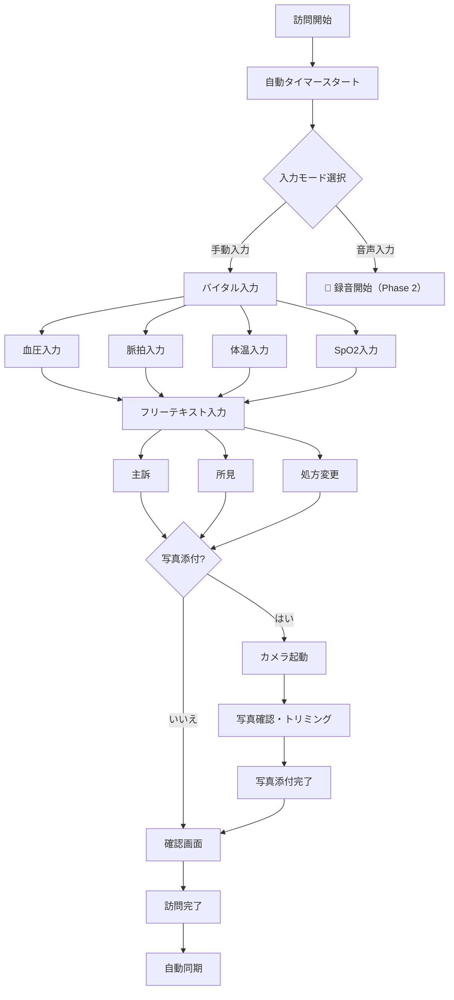
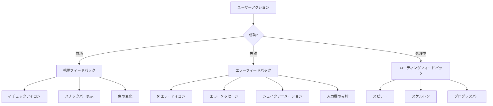

# Visitas Frontend要件定義書

> ユーザー中心設計に基づく、在宅医療向けモバイル・Web UIの詳細仕様

## ドキュメント管理情報

| 項目 | 内容 |
|------|------|
| 作成日 | 2025-12-12 |
| バージョン | 1.0 |
| 対象フェーズ | Phase 1 MVP |
| 対象プラットフォーム | iOS, Android, Web |

---

## 目次

1. [ユーザーペルソナ](#1-ユーザーペルソナ)
2. [デザイン原則](#2-デザイン原則)
3. [画面遷移フロー](#3-画面遷移フロー)
4. [UI仕様詳細](#4-ui仕様詳細)
5. [インタラクションパターン](#5-インタラクションパターン)
6. [デザインシステム](#6-デザインシステム)
7. [アクセシビリティ](#7-アクセシビリティ)
8. [レスポンシブ設計](#8-レスポンシブ設計)

---

## 1. ユーザーペルソナ

### 1.1 プライマリーペルソナ：訪問診療医師

```
┌─────────────────────────────────────────────────────────────────┐
│  👨‍⚕️ 田中 健一（52歳）- 在宅専門医                               │
├─────────────────────────────────────────────────────────────────┤
│  【プロフィール】                                                │
│  ・内科医、在宅医療歴15年                                        │
│  ・1日平均8〜12件の訪問診療                                      │
│  ・スマートフォン利用歴10年（iPhone愛用）                         │
│                                                                 │
│  【1日のタイムライン】                                           │
│  08:00  クリニック出発前に今日のスケジュール確認                   │
│  08:30  1件目の患者宅へ移動（カーナビ利用）                        │
│  09:00  診療→診療記録を簡単にメモ                                │
│  09:30  次の患者宅へ移動                                         │
│  ...（繰り返し）                                                 │
│  18:00  クリニックに戻りカルテ記載（パジャマタイム）                │
│                                                                 │
│  【Pain Points】                                                │
│  ・移動中にスケジュール変更があると対応が大変                      │
│  ・患者宅でカルテを開くのに時間がかかる                           │
│  ・圏外エリアでデータが見られないことがある                        │
│  ・帰院後のカルテ記載に2時間以上かかる                            │
│                                                                 │
│  【Goals】                                                      │
│  ✓ 患者情報に3タップ以内でアクセスしたい                          │
│  ✓ 移動中も安全にナビゲーションを開始したい                        │
│  ✓ 圏外でも最低限の情報は見たい                                   │
│  ✓ 音声入力でカルテを書きたい（Phase 2）                          │
└─────────────────────────────────────────────────────────────────┘
```

### 1.2 セカンダリーペルソナ：訪問看護師

```
┌─────────────────────────────────────────────────────────────────┐
│  👩‍⚕️ 佐藤 美咲（38歳）- 訪問看護師                                │
├─────────────────────────────────────────────────────────────────┤
│  【プロフィール】                                                │
│  ・看護師歴12年、訪問看護歴5年                                    │
│  ・1日平均5〜7件の訪問                                           │
│  ・Android使用（Pixel）                                         │
│                                                                 │
│  【主な業務】                                                   │
│  ・バイタルサイン測定と記録                                      │
│  ・処置（褥瘡ケア、カテーテル管理等）                             │
│  ・患者・家族への指導                                            │
│  ・医師への報告                                                  │
│                                                                 │
│  【Pain Points】                                                │
│  ・バイタル入力に時間がかかる                                    │
│  ・写真撮影→記録添付の手順が煩雑                                 │
│  ・緊急時に医師へすぐ連絡が取れない                               │
│                                                                 │
│  【Goals】                                                      │
│  ✓ バイタル入力は10秒以内で完了したい                             │
│  ✓ 写真は撮影→添付がワンタップで済ませたい                        │
│  ✓ 緊急時は1タップで医師に電話したい                              │
└─────────────────────────────────────────────────────────────────┘
```

### 1.3 ターシャリーペルソナ：医療事務スタッフ

```
┌─────────────────────────────────────────────────────────────────┐
│  👩‍💼 山田 花子（45歳）- 医療事務                                  │
├─────────────────────────────────────────────────────────────────┤
│  【プロフィール】                                                │
│  ・医療事務歴20年、在宅クリニック歴8年                            │
│  ・PCメイン（Web管理画面を使用）                                  │
│  ・Excel/Wordは得意、新しいシステムには慎重                        │
│                                                                 │
│  【主な業務】                                                   │
│  ・訪問スケジュールの作成・調整                                   │
│  ・患者登録・情報更新                                            │
│  ・保険請求書類の作成                                            │
│  ・電話対応（患者・家族からの問い合わせ）                          │
│                                                                 │
│  【Pain Points】                                                │
│  ・医師のスケジュール調整が複雑                                   │
│  ・スケジュール変更時の連絡漏れ                                   │
│  ・紙とデジタルの二重管理                                        │
│                                                                 │
│  【Goals】                                                      │
│  ✓ ドラッグ＆ドロップでスケジュール変更したい                      │
│  ✓ 変更は自動で関係者に通知してほしい                             │
│  ✓ 印刷用PDFをすぐ出力したい                                     │
└─────────────────────────────────────────────────────────────────┘
```

---

## 2. デザイン原則

### 2.1 コア原則

#### 🎯 原則1: 「3タップ以内」の法則

> 全ての重要機能は、ホーム画面から**3タップ以内**でアクセス可能でなければならない。

| 機能 | タップ数 | 経路 |
|------|----------|------|
| 今日の訪問一覧 | 1 | ホーム→（即表示） |
| 患者詳細 | 2 | ホーム→カード選択 |
| ナビ開始 | 2 | ホーム→カード内ナビボタン |
| バイタル入力 | 3 | ホーム→カード選択→バイタルタブ |
| 緊急連絡 | 2 | どの画面からも→FAB長押し |

#### 🌟 原則2: 「視認性優先」のUI

> 医療現場では、**暗い場所**（患者宅）や**まぶしい屋外**での使用が想定される。高コントラスト・大きなタップ領域を必須とする。

- **最小タップ領域**: 48dp × 48dp（Material Design 3準拠）
- **テキストサイズ**: 本文最小16sp、見出し最小20sp
- **コントラスト比**: WCAG AA準拠（4.5:1以上）

#### ⚡ 原則3: 「待たせない」パフォーマンス

> 医師の時間は貴重。**体感待ち時間ゼロ**を目指す。

- **スケルトンスクリーン**: データ読み込み中は骨格を表示
- **楽観的UI**: ユーザーアクションは即座にローカル反映
- **プリフェッチ**: 次に訪問する患者データを事前読み込み

#### 🔐 原則4: 「安心」のセキュリティ体験

> セキュリティは厳格に、しかしユーザー体験を損なわない。

- **生体認証優先**: パスワード入力は最小限に
- **自動ログアウト**: 30分間操作なしで再認証
- **視覚的フィードバック**: ロック状態を明示（🔒アイコン）

---

### 2.2 デザインシステム概要



---

## 3. 画面遷移フロー

### 3.1 モバイルアプリ（医師・看護師向け）

#### メイン画面遷移図



#### スケジュール詳細フロー



### 3.2 Web管理画面（事務スタッフ向け）



---

## 4. UI仕様詳細

### 4.1 モバイル：ホーム画面（今日のスケジュール）

#### ワイヤーフレーム

```
┌─────────────────────────────────────────┐
│  ステータスバー                          │
├─────────────────────────────────────────┤
│                                         │
│  👋 おはようございます、田中先生          │
│  12月12日（木）の訪問予定                │
│                                         │
│  ┌─────────────────────────────────────┐│
│  │ 🔵 09:00 - 09:30                    ││
│  │ ━━━━━━━━━━━━━━━━━━━━━━━━━━━━━━━━━━━ ││
│  │ 山本 太郎 様（78歳・男性）           ││
│  │ 📍 千代田区神田1-2-3                 ││
│  │ 🏷️ 独居 | 認知症 | 定期訪問          ││
│  │                                     ││
│  │ [🗺️ ナビ] [📞 電話] [▶️ 訪問開始]    ││
│  └─────────────────────────────────────┘│
│                                         │
│  ┌─────────────────────────────────────┐│
│  │ ⚪ 10:00 - 10:30                    ││
│  │ ━━━━━━━━━━━━━━━━━━━━━━━━━━━━━━━━━━━ ││
│  │ 鈴木 花子 様（85歳・女性）           ││
│  │ 📍 千代田区麹町4-5-6                 ││
│  │ 🚗 前の訪問先から車で12分            ││
│  │ 🏷️ 末期がん | 麻薬処方               ││
│  └─────────────────────────────────────┘│
│                                         │
│  ... (スクロール可能)                    │
│                                         │
├─────────────────────────────────────────┤
│  [🏠 ホーム] [🔍 検索] [📊 ダッシュボード] [⚙️] │
└─────────────────────────────────────────┘
```

#### コンポーネント仕様：訪問カード

| プロパティ | 仕様 |
|-----------|------|
| **高さ** | 可変（コンテンツに応じる）、最小180dp |
| **角丸** | 16dp |
| **影** | Elevation 2dp（タップ時4dp） |
| **背景色** | Surface（#FFFFFF / Dark: #1E1E1E） |
| **左ボーダー** | 4dp幅、ステータス色 |

**ステータス色定義：**

| ステータス | 色 | 用途 |
|-----------|-----|------|
| 予定 | `#2196F3` (Blue) | 訪問前 |
| 進行中 | `#FF9800` (Orange) | 訪問中 |
| 完了 | `#4CAF50` (Green) | 訪問完了 |
| キャンセル | `#9E9E9E` (Gray) | キャンセル済み |
| 緊急 | `#F44336` (Red) | 緊急往診 |

---

### 4.2 モバイル：患者詳細画面

#### タブ構成



#### ワイヤーフレーム

```
┌─────────────────────────────────────────┐
│ ← 戻る      患者詳細                📞 │
├─────────────────────────────────────────┤
│                                         │
│  ┌─────────────────────────────────────┐│
│  │      👤                            ││
│  │  山本 太郎 様                      ││
│  │  78歳・男性                        ││
│  │  ID: PT-00001234                   ││
│  └─────────────────────────────────────┘│
│                                         │
│  [基本情報] [訪問履歴] [バイタル] [地図]  │
│  ━━━━━━━━━━                              │
│                                         │
│  📍 住所                               │
│  〒101-0001                            │
│  東京都千代田区神田1-2-3               │
│  ABCマンション 301号室                 │
│                                         │
│  📞 連絡先                             │
│  本人: 090-1234-5678                   │
│  緊急: 03-1234-5678（長男）            │
│                                         │
│  ⚠️ アレルギー・禁忌                    │
│  ┌─────────────────────────────────────┐│
│  │ 🔴 ペニシリン系抗生物質             ││
│  │ 🟡 アスピリン（要注意）             ││
│  └─────────────────────────────────────┘│
│                                         │
│  🏥 主病名                             │
│  ・慢性心不全                          │
│  ・2型糖尿病                           │
│  ・認知症（アルツハイマー型）           │
│                                         │
├─────────────────────────────────────────┤
│        [▶️ 訪問を開始する]              │
└─────────────────────────────────────────┘
```

---

### 4.3 モバイル：訪問記録入力画面

#### 入力フロー



#### バイタル入力UI

```
┌─────────────────────────────────────────┐
│ ✕ 閉じる    訪問記録        ⏱️ 00:15:32 │
├─────────────────────────────────────────┤
│                                         │
│  バイタルサイン                         │
│  ━━━━━━━━━━━━━━━━━━━━━━━━━━━━━━━━━━━━━━ │
│                                         │
│  血圧                                   │
│  ┌───────────┐   ┌───────────┐         │
│  │   135    │ / │    85    │ mmHg     │
│  └───────────┘   └───────────┘         │
│      収縮期           拡張期             │
│                                         │
│  脈拍              体温                 │
│  ┌───────────┐   ┌───────────┐         │
│  │    72    │   │   36.5   │          │
│  └───────────┘   └───────────┘         │
│    bpm              ℃                  │
│                                         │
│  SpO2                                   │
│  ┌───────────┐                         │
│  │    98    │ %                        │
│  └───────────┘                         │
│                                         │
│  ━━━━━━━━━━━━━━━━━━━━━━━━━━━━━━━━━━━━━━ │
│                                         │
│  主訴（患者の訴え）                      │
│  ┌─────────────────────────────────────┐│
│  │ 最近、足のむくみがひどい。          ││
│  │ 夜間に息苦しくなることがある。      ││
│  │                                     ││
│  └─────────────────────────────────────┘│
│                                         │
│  [📸 写真を追加]                        │
│                                         │
├─────────────────────────────────────────┤
│  [下書き保存]        [✓ 訪問完了]       │
└─────────────────────────────────────────┘
```

**ポイント：**
- 数値入力は**テンキー専用キーボード**を起動
- 前回値をプレースホルダーとして表示（「前回: 130/82」）
- 異常値は**自動ハイライト**（血圧180以上→赤背景）

---

### 4.4 Web管理画面：スケジュール管理

#### カレンダービュー

```
┌──────────────────────────────────────────────────────────────────────────┐
│  Visitas                                    🔔 3  👤 山田 花子  ログアウト │
├─────────────┬────────────────────────────────────────────────────────────┤
│             │                                                            │
│  📊 ダッシュ │  スケジュール管理                                          │
│             │  ━━━━━━━━━━━━━━━━━━━━━━━━━━━━━━━━━━━━━━━━━━━━━━━━━━━━━━━━━━ │
│  📅 スケジュ│                                                            │
│     ール    │  [📅 カレンダー] [📊 ガントチャート]    2024年12月  [< >]   │
│             │                                                            │
│  👥 患者管理│  ┌──────┬──────┬──────┬──────┬──────┬──────┬──────┐       │
│             │  │  月  │  火  │  水  │  木  │  金  │  土  │  日  │       │
│  👨‍⚕️ 医師管 │  │   9  │  10  │  11  │  12  │  13  │  14  │  15  │       │
│     理      │  ├──────┼──────┼──────┼──────┼──────┼──────┼──────┤       │
│             │  │      │      │      │ 今日 │      │      │      │       │
│  📄 レポート│  │      │      │      │      │      │      │      │       │
│             │  │ 田中医│ 田中医│ 田中医│ 田中医│ 田中医│      │      │       │
│  ⚙️ 設定   │  │ 🔵🔵🔵│ 🔵🔵  │ 🔵🔵🔵│ 🔵🔵🔵│ 🔵🔵  │      │      │       │
│             │  │ 🔵🔵  │ 🔵🔵🔵│ 🔵    │ 🔵🔵  │ 🔵🔵🔵│      │      │       │
│             │  │      │      │      │      │      │      │      │       │
│             │  │ 佐藤医│ 佐藤医│ 休暇  │ 佐藤医│ 佐藤医│      │      │       │
│             │  │ 🔵🔵🔵│ 🔵🔵🔵│      │ 🔵🔵🔵│ 🔵🔵🔵│      │      │       │
│             │  │ 🔵🔵  │ 🔵    │      │ 🔵🔵  │ 🔵    │      │      │       │
│             │  └──────┴──────┴──────┴──────┴──────┴──────┴──────┘       │
│             │                                                            │
│             │  ─────────────────────────────────────────────────────────│
│             │                                                            │
│             │  📋 未割当の患者（3件）                                     │
│             │  ┌───────────────────────────────────────────────────────┐ │
│             │  │ 🟡 高橋一郎 様 - 要訪問（12月中）- 定期訪問           │ │
│             │  │ 🟡 伊藤次郎 様 - 要訪問（今週中）- 処方更新           │ │
│             │  │ 🔴 渡辺三郎 様 - 緊急（本日中）- 状態悪化             │ │
│             │  └───────────────────────────────────────────────────────┘ │
│             │                                                            │
└─────────────┴────────────────────────────────────────────────────────────┘
```

**インタラクション：**
- **ドラッグ＆ドロップ**: 未割当患者をカレンダーにドロップしてスケジュール登録
- **ホバー**: スケジュールにホバーで詳細ポップアップ表示
- **ダブルクリック**: スケジュール編集モーダルを開く

---

## 5. インタラクションパターン

### 5.1 マイクロインタラクション

| アクション | アニメーション | 時間 |
|-----------|---------------|------|
| カードタップ | リップルエフェクト + スケール0.98 | 100ms |
| 画面遷移（プッシュ） | 右からスライドイン | 300ms (ease-out) |
| 画面遷移（モーダル） | 下からスライドアップ + フェードイン | 250ms |
| ボタンタップ | Elevation変化（2dp→4dp） | 50ms |
| 訪問完了 | チェックマークアニメーション + 振動 | 400ms |
| データ読み込み | スケルトンスクリーン（シマー） | 継続 |
| 保存成功 | スナックバー（下から出現） | 3000ms自動非表示 |
| エラー発生 | シェイクアニメーション + 赤ハイライト | 500ms |

### 5.2 ジェスチャー

| ジェスチャー | 画面 | 動作 |
|------------|------|------|
| 左スワイプ | 訪問カード | クイックアクション表示（電話・ナビ） |
| 右スワイプ | 訪問カード | キャンセル確認 |
| プルダウン | リスト画面 | データ更新 |
| ピンチイン/アウト | 地図・グラフ | ズーム |
| 長押し | 任意のカード | コンテキストメニュー表示 |

### 5.3 フィードバックパターン



---

## 6. デザインシステム

### 6.1 カラーパレット

```
┌─────────────────────────────────────────────────────────────────┐
│                        ライトテーマ                             │
├─────────────────────────────────────────────────────────────────┤
│  Primary      #1976D2  ████████  信頼感のあるブルー            │
│  Secondary    #26A69A  ████████  医療的な清潔感のあるティール   │
│  Error        #D32F2F  ████████  警告・エラー                  │
│  Warning      #FFA000  ████████  注意喚起                      │
│  Success      #388E3C  ████████  成功・完了                    │
│  Background   #FAFAFA  ████████  背景                          │
│  Surface      #FFFFFF  ████████  カード・コンテナ               │
│  On Primary   #FFFFFF  ████████  プライマリ上のテキスト         │
│  On Surface   #212121  ████████  サーフェス上のテキスト         │
├─────────────────────────────────────────────────────────────────┤
│                        ダークテーマ                             │
├─────────────────────────────────────────────────────────────────┤
│  Primary      #90CAF9  ████████  柔らかなブルー                │
│  Secondary    #80CBC4  ████████  柔らかなティール               │
│  Error        #EF5350  ████████  エラー（明るめ）               │
│  Background   #121212  ████████  背景                          │
│  Surface      #1E1E1E  ████████  カード・コンテナ               │
│  On Primary   #000000  ████████  プライマリ上のテキスト         │
│  On Surface   #FFFFFF  ████████  サーフェス上のテキスト         │
└─────────────────────────────────────────────────────────────────┘
```

### 6.2 タイポグラフィ

| 用途 | フォント | サイズ | ウェイト | 行送り |
|------|---------|--------|---------|--------|
| Display Large | Noto Sans JP | 57sp | Bold | 64sp |
| Headline Large | Noto Sans JP | 32sp | Bold | 40sp |
| Headline Medium | Noto Sans JP | 28sp | Medium | 36sp |
| Title Large | Noto Sans JP | 22sp | Medium | 28sp |
| Title Medium | Noto Sans JP | 16sp | Medium | 24sp |
| Body Large | Noto Sans JP | 16sp | Regular | 24sp |
| Body Medium | Noto Sans JP | 14sp | Regular | 20sp |
| Label Large | Noto Sans JP | 14sp | Medium | 20sp |
| Label Small | Noto Sans JP | 11sp | Medium | 16sp |

### 6.3 スペーシング

```
4dp  ─ 最小余白（アイコン内など）
8dp  ─ 要素間の最小間隔
12dp ─ コンパクトな間隔
16dp ─ 標準的な間隔
24dp ─ セクション間
32dp ─ 大きなセクション間
48dp ─ 画面端からのマージン
```

### 6.4 エレベーション（影）

| レベル | 用途 |
|--------|------|
| 0dp | 背景、フラットなコンテンツ |
| 1dp | カード（デフォルト） |
| 2dp | 浮遊ボタン（FAB）、ツールバー |
| 4dp | モーダル、ドロップダウン |
| 8dp | ダイアログ、ピッカー |
| 16dp | ナビゲーションドロワー |

---

## 7. アクセシビリティ

### 7.1 要件

| 項目 | 基準 | 実装 |
|------|------|------|
| コントラスト比 | WCAG AA (4.5:1) | カラーパレットで保証 |
| タップ領域 | 最小48×48dp | 全タップ要素に適用 |
| フォントサイズ | 最小16sp | システムフォントサイズに連動 |
| スクリーンリーダー | TalkBack/VoiceOver対応 | 全要素にセマンティックラベル |
| キーボードナビ | Tab/Enter操作可能 | Web管理画面で実装 |
| 色覚多様性 | 色以外でも情報識別可 | アイコン・パターン併用 |

### 7.2 セマンティックラベル例

```dart
// Flutter実装例
Semantics(
  label: '山本太郎様、78歳、9時から9時30分の訪問予定',
  button: true,
  child: VisitCard(...),
)

IconButton(
  icon: Icon(Icons.phone),
  onPressed: () => launchPhone(),
  tooltip: '緊急連絡先に電話',
)
```

### 7.3 音声読み上げ順序

1. 患者名と基本情報
2. 訪問時刻
3. 住所
4. 重要タグ（アレルギー、独居等）
5. 利用可能なアクション

---

## 8. レスポンシブ設計

### 8.1 ブレークポイント

| デバイス | 幅 | レイアウト |
|----------|-----|-----------|
| モバイル（縦） | < 600dp | 1カラム、ボトムナビ |
| モバイル（横） | 600-839dp | 1カラム、サイドナビ |
| タブレット | 840-1199dp | 2カラム（マスター・ディテール） |
| デスクトップ | ≥ 1200dp | 3カラム、サイドバー固定 |

### 8.2 レイアウト適応

```
【モバイル縦】           【タブレット】            【デスクトップ】
┌──────────────┐    ┌──────────────────────┐  ┌────────────────────────────┐
│   ヘッダー    │    │   ヘッダー            │  │   ヘッダー                  │
├──────────────┤    ├───────┬──────────────┤  ├─────┬────────┬─────────────┤
│              │    │       │              │  │     │        │             │
│   患者一覧   │    │ 患者  │   患者詳細   │  │ ナビ │ 患者   │  患者詳細   │
│   (フル幅)   │    │ 一覧  │              │  │     │ 一覧   │             │
│              │    │       │              │  │     │        │             │
│              │    │       │              │  │     │        │             │
├──────────────┤    │       │              │  │     │        │             │
│  ボトムナビ   │    │       │              │  │     │        │             │
└──────────────┘    └───────┴──────────────┘  └─────┴────────┴─────────────┘
```

---

## 付録A: 画面一覧

| ID | 画面名 | プラットフォーム | 優先度 |
|----|--------|-----------------|--------|
| M-001 | ログイン | Mobile | 必須 |
| M-002 | 生体認証 | Mobile | 必須 |
| M-003 | ホーム（今日のスケジュール） | Mobile | 必須 |
| M-004 | 患者検索 | Mobile | 必須 |
| M-005 | 患者詳細 | Mobile | 必須 |
| M-006 | 訪問記録入力 | Mobile | 必須 |
| M-007 | バイタル推移グラフ | Mobile | 推奨 |
| M-008 | 写真撮影・添付 | Mobile | 推奨 |
| M-009 | 設定 | Mobile | 必須 |
| M-010 | オフライン状態表示 | Mobile | 必須 |
| W-001 | ログイン | Web | 必須 |
| W-002 | ダッシュボード | Web | 必須 |
| W-003 | スケジュール管理 | Web | 必須 |
| W-004 | 患者管理 | Web | 必須 |
| W-005 | 患者登録フォーム | Web | 必須 |
| W-006 | 医師管理 | Web | 必須 |
| W-007 | レポート | Web | 推奨 |
| W-008 | 設定 | Web | 必須 |

---

## 付録B: 用語集

| 用語 | 説明 |
|------|------|
| SOAP | 診療記録の形式（Subjective, Objective, Assessment, Plan） |
| バイタルサイン | 生命徴候（血圧、脈拍、体温、SpO2） |
| SpO2 | 経皮的動脈血酸素飽和度 |
| FAB | Floating Action Button（浮遊ボタン） |
| スケルトンスクリーン | ローディング中に表示する骨格UI |
| 楽観的UI | ユーザーアクションを即座にUIに反映する設計 |

---

## 変更履歴

| バージョン | 日付 | 変更内容 |
|-----------|------|----------|
| 1.0 | 2025-12-12 | 初版作成 |
